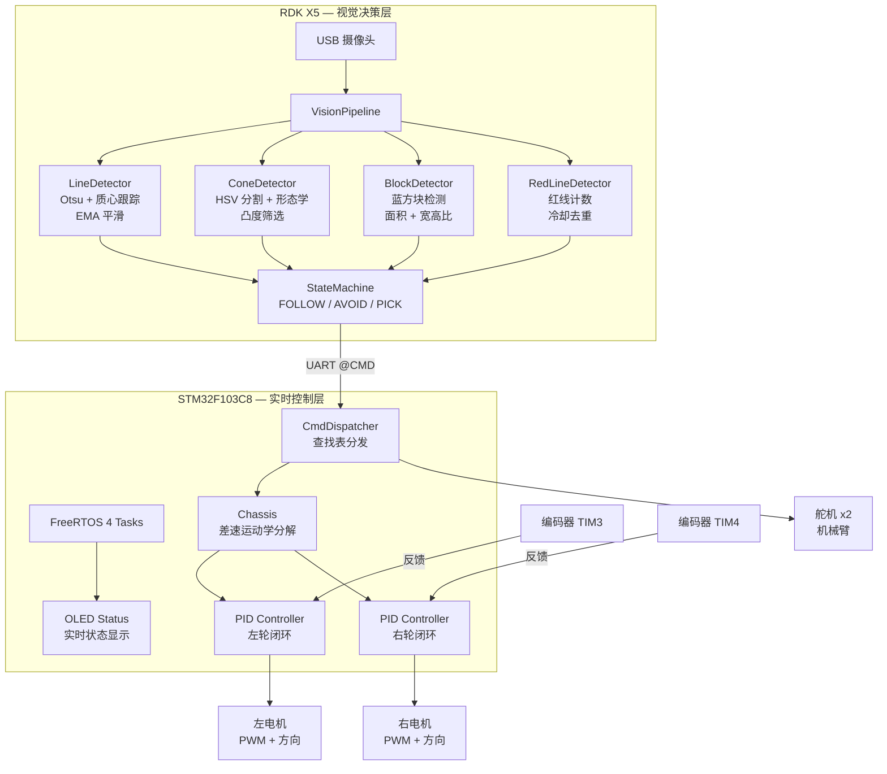
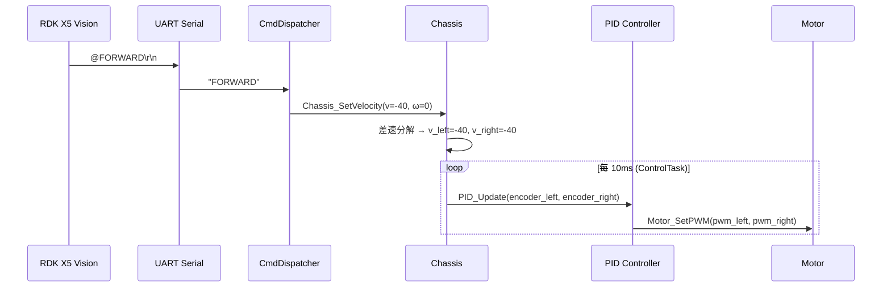
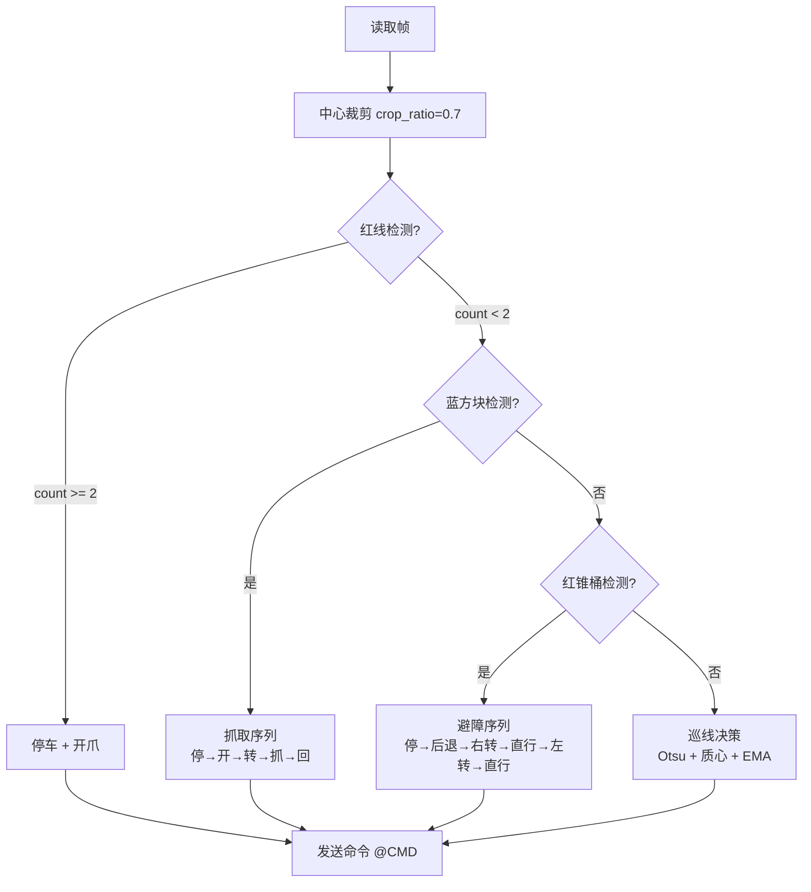

# RC-Car

> **STM32F103 + FreeRTOS + RDK X5 视觉智能小车**
>
> 双轮差速驱动 | 编码器闭环 PID | OpenCV 巡线/避障/抓取 | 状态机架构

基于 STM32F103C8 和 RDK X5 的双核协作智能小车系统。STM32 端运行 FreeRTOS 实时调度，负责电机 PID 速度闭环、舵机控制和 OLED 状态显示；RDK X5 端运行 OpenCV 视觉流水线，实现黑线巡线、红色锥桶避障、蓝色方块自动抓取和地面红线计数。两端通过 UART 串口协议 `@CMD\r\n` 进行实时通信。

---

## 系统架构



---

## 技术栈

### STM32 端（C / FreeRTOS）

| 模块 | 说明 |
|------|------|
| **FreeRTOS** | 抢占式调度，4 个任务：Control (10ms) / Command / Display (100ms) / Idle |
| **PID Controller** | 位置式/增量式可切换，积分抗饱和，微分先行，双轮独立参数 |
| **Chassis** | 双轮差速运动学：`(v, ω) → (v_left, v_right)`，速度闭环控制 |
| **CmdDispatcher** | O(1) 查找表分发，替代 if-else 链，新增命令只需加一行表项 |
| **Encoder** | TIM3/TIM4 硬件编码器接口，TI12 四倍频，13 PPR × 34:1 减速比 |
| **OLED** | 实时显示轮速、线速度/角速度、控制模式、命令计数 |

### RDK X5 端（Python / OpenCV）

| 模块 | 说明 |
|------|------|
| **VisionPipeline** | 视觉检测流水线，聚合 4 个独立检测器 |
| **LineDetector** | Otsu 自适应二值化 → 轮廓质心 → EMA 平滑 → 方向决策 |
| **ConeDetector** | HSV 双阈值红色分割 → 形态学开闭运算 → 凸度+高宽比筛选 |
| **BlockDetector** | HSV 蓝色分割 → 面积/边长/宽高比三级过滤 |
| **RedLineDetector** | 底部 ROI 红色分割 → 长宽比判定 → 带冷却的自动计数 |
| **StateMachine** | Enum 状态机：FOLLOW → AVOID / PICK_ACTION / RED_LINE_STOP |
| **CarController** | 主控制器，协调视觉流水线、状态机和串口通信 |

---

## 控制链路



---

## FreeRTOS 任务架构

| 任务 | 周期 | 优先级 | 栈大小 | 职责 |
|------|------|--------|--------|------|
| **ControlTask** | 10ms | 最高 | 512B | 读编码器 + 更新底盘 PID 控制 |
| **CommandTask** | 阻塞 | 高 | 512B | 等待命令队列 + 分发到回调 |
| **DisplayTask** | 100ms | 中 | 512B | OLED 刷新系统状态 |
| **IdleTask** | 1s | 最低 | 256B | 心跳指示 |

**内核对象：** 1 个命令队列（深度 8） + 1 个 OLED 互斥锁

---

## PID 控制器

```c
/* 位置式 PID — 基于测量值微分（避免目标突变尖刺） */
output = Kp * error + Ki * integral + Kd * (-dMeasurement/dt)

/* 特性 */
- 积分抗饱和（integral clamping）
- 微分先行（derivative on measurement）
- 输出限幅
- 增量式/位置式双模式
```

左右轮独立 PID 参数（补偿机械差异）：

| 参数 | 左轮 | 右轮 |
|------|------|------|
| Kp | 0.20 | 0.30 |
| Ki | 0.27 | 0.21 |
| Kd | 0.01 | 0.01 |
| 积分限幅 | 500 | 500 |
| 输出限幅 | 100 | 100 |

---

## 差速运动学

```
v_left  = linear_speed - angular_speed × (wheelbase / 2)
v_right = linear_speed + angular_speed × (wheelbase / 2)

wheelbase = 16cm（左右轮中心距）
```

上位机只需指定 `(线速度, 角速度)`，底盘模块自动分解为左右轮目标转速。

---

## 视觉决策流程



---

## 硬件平台

| 组件 | 型号 | 说明 |
|------|------|------|
| 主控 | STM32F103C8 | Cortex-M3, 72MHz, 64KB Flash, 20KB RAM |
| 视觉 | RDK X5 | Linux SBC, OpenCV, USB 摄像头 |
| 电机驱动 | L298N / TB6612 | 双路 H 桥，PWM 调速 |
| 编码器 | 光电编码器 x2 | 13 PPR, 34:1 减速比, TIM3/TIM4 硬件解码 |
| 舵机 | SG90 x2 | 机械臂 + 抓取爪 |
| 显示 | 0.96" OLED | I2C/SPI, 128x64 |
| 通信 | UART 115200bps | RDK X5 ↔ STM32, `@CMD\r\n` 协议 |

### 引脚分配

| 外设 | 引脚 | 用途 |
|------|------|------|
| TIM3 CH1/CH2 | PA6/PA7 | 左轮编码器 |
| TIM4 CH1/CH2 | PB6/PB7 | 右轮编码器 |
| TIM2 CH1/CH2 | PA0/PA1 | 电机 PWM |
| TIM1 | 中断 | 控制周期定时 |
| USART1 | PA9/PA10 | 串口通信 |
| GPIO | PB12-PB15 | 电机方向控制 |
| OLED | PB8/PB9 (I2C) | 状态显示 |

---

## 目录结构

```
RC-Car/
├── firmware/                       # STM32 固件（Keil MDK-ARM）
│   ├── App/                        # 应用层模块
│   │   ├── pid.c/h                 # PID 控制器（位置式 + 增量式）
│   │   ├── chassis.c/h             # 底盘运动控制（差速运动学 + 双闭环）
│   │   ├── cmd_dispatch.c/h        # 串口命令分发表
│   │   └── FreeRTOSConfig.h        # FreeRTOS 配置
│   ├── Hardware/                   # 硬件驱动层
│   │   ├── Motor.c/h               # 电机驱动（PWM + 方向 GPIO）
│   │   ├── Encoder.c/h             # 编码器（TIM3/TIM4 硬件解码）
│   │   ├── Servo.c/h               # 舵机控制
│   │   ├── PWM.c/h                 # PWM 输出配置
│   │   ├── Serial.c/h              # 串口驱动（状态机接收 @CMD\r\n）
│   │   ├── OLED.c/h                # OLED 显示驱动
│   │   └── MyI2C.c/h               # 软件 I2C
│   ├── System/                     # 系统工具
│   │   ├── Delay.c/h               # 延时函数
│   │   └── Timer.c/h               # 定时器配置
│   ├── User/                       # 主程序
│   │   └── main.c                  # FreeRTOS 多任务入口
│   ├── Library/                    # STM32 标准外设库
│   ├── Start/                      # 启动文件 + CMSIS
│   ├── FreeRTOS/                   # FreeRTOS 内核（待引入）
│   └── Project.uvprojx             # Keil 工程文件
├── vision/                         # RDK X5 视觉决策
│   ├── line_follower.py            # 主程序（类封装 + 状态机）
│   └── requirements.txt            # Python 依赖
├── web/                            # Web 交互界面
│   └── 小车交互界面.html             # 远程控制网页
├── hardware/                       # 硬件设计文件
│   ├── 电机驱动原理图1.pdf
│   ├── 设计书.docx
│   └── 转向环思路.docx
├── .gitignore
└── README.md
```

---

## 快速开始

### STM32 固件编译

1. 使用 **Keil MDK-ARM V5** 打开 `firmware/Project.uvprojx`
2. 需要将 FreeRTOS 源码放入 `firmware/FreeRTOS/`（见下方说明）
3. Build 编译，通过 ST-Link 烧录

### RDK X5 视觉端

```bash
cd vision
pip install -r requirements.txt
python line_follower.py
```

### FreeRTOS 引入说明

本项目已编写完整的 FreeRTOS 任务代码，需手动引入 FreeRTOS 内核：

1. 从 [FreeRTOS 官网](https://www.freertos.org/) 下载源码
2. 将 `Source/` 目录复制到 `firmware/FreeRTOS/`
3. 在 Keil 工程中添加 `App/` 和 `FreeRTOS/` 源文件
4. 包含路径添加 `App/` 和 `FreeRTOS/include/`
5. 将 `App/FreeRTOSConfig.h` 设为项目配置头文件

---

## 串口协议

| 方向 | 格式 | 示例 |
|------|------|------|
| RDK X5 → STM32 | `@CMD\r\n` | `@FORWARD\r\n` |
| 命令列表 | - | `FORWARD` `BACK` `LEFT` `RIGHT` `STOP` |
| | | `AVOID_FORWARD` `AVOID_BACK` `AVOID_LEFT` `AVOID_RIGHT` |
| | | `LITTLELEFT` `LITTLERIGHT` |
| | | `BLUE_OPEN` `BLUE_GRAB` `BLUE_TURN` `BLUE_RETURN` |

---

## 许可证

MIT License
